# Laravel TDD with Pest

## Core Principle

Write the test first. Watch it fail. Write minimal code to pass.

**In Laravel: a feature is not done until `php artisan test` is green.**

## Iron Law

```
NO PRODUCTION CODE WITHOUT A FAILING PEST TEST FIRST
```

Wrote code before the test? Delete it. Start over.
No exceptions — not for "simple" things, not for "obvious" fixes.

## Red-Green-Refactor

```dot
digraph tdd {
    rankdir=LR;
    red [label="RED\nWrite failing Pest test", shape=box, style=filled, fillcolor="#ffcccc"];
    verify [label="Verify:\ntest fails for RIGHT reason", shape=diamond];
    green [label="GREEN\nMinimal Laravel code", shape=box, style=filled, fillcolor="#ccffcc"];
    pass [label="php artisan test\npasses?", shape=diamond];
    refactor [label="REFACTOR\nClean up, keep green", shape=box, style=filled, fillcolor="#ccccff"];

    red -> verify;
    verify -> green [label="yes, correct failure"];
    verify -> red [label="wrong failure\nor passes unexpectedly"];
    green -> pass;
    pass -> refactor [label="yes"];
    pass -> green [label="no"];
    refactor -> pass [label="stay green"];
}
```



## Step 0: Choose the Right Test Type

**Before writing anything**, decide Feature vs Unit:

| Situation | Test Type | Trait |
|-----------|-----------|-------|
| HTTP endpoint, form, API | Feature | `RefreshDatabase` |
| Eloquent model logic | Feature | `RefreshDatabase` |
| Service/Action class | Feature (if DB needed) or Unit | `RefreshDatabase` / none |
| Pure computation, no DB, no HTTP | Unit | none |
| Queue job | Feature | `RefreshDatabase` |
| Mail, notification | Feature | `RefreshDatabase` |

**Default: Feature test.** Only use Unit when there is genuinely no database or HTTP involved.

Create test file:
```bash
php artisan make:test UserRegistrationTest           # Feature (default)
php artisan make:test PriceCalculatorTest --unit     # Unit
```

## Step 1: RED — Write the Failing Test

### Basic Pest structure (Laravel)

```php
<?php

use App\Models\User;
use Illuminate\Foundation\Testing\RefreshDatabase;

uses(RefreshDatabase::class);

test('new user receives welcome email after registration', function () {
    Mail::fake();

    $response = $this->postJson('/api/register', [
        'name'                  => 'Anna Müller',
        'email'                 => 'anna@example.com',
        'password'              => 'secret123',
        'password_confirmation' => 'secret123',
    ]);

    $response->assertCreated();
    Mail::assertSent(WelcomeMail::class, fn ($m) => $m->hasTo('anna@example.com'));
});
```

**Run it:** `php artisan test --filter "new user receives welcome email"`

**Verify it fails** — and fails for the right reason (e.g., `Expected response status 201 but received 404`, not a syntax error).

### HTTP testing patterns

```php
// GET
$this->getJson('/api/users')->assertOk()->assertJsonCount(3, 'data');

// POST
$this->postJson('/api/posts', ['title' => 'Hello'])
     ->assertCreated()
     ->assertJsonPath('data.title', 'Hello');

// PUT/PATCH
$this->putJson("/api/posts/{$post->id}", ['title' => 'Updated'])
     ->assertOk();

// DELETE
$this->deleteJson("/api/posts/{$post->id}")->assertNoContent();

// Acting as a user
$this->actingAs($user)->getJson('/api/me')->assertOk();

// With specific token/guard
$this->actingAs($user, 'api')->getJson('/api/profile')->assertOk();
```

### Database assertions

```php
$this->assertDatabaseHas('users', ['email' => 'anna@example.com']);
$this->assertDatabaseMissing('users', ['email' => 'deleted@example.com']);
$this->assertDatabaseCount('posts', 3);
$this->assertSoftDeleted('posts', ['id' => $post->id]);

// Pest-style (preferred)
expect(User::count())->toBe(1);
expect(User::where('email', 'anna@example.com')->exists())->toBeTrue();
```

### Factory patterns

```php
// Create persisted model
$user = User::factory()->create();
$admin = User::factory()->admin()->create();     // named state

// Create without saving (for unit tests)
$user = User::factory()->make();

// With relationships
$post = Post::factory()
    ->for(User::factory()->create())
    ->hasComments(3)
    ->create();

// With specific attributes
$user = User::factory()->create(['email' => 'specific@test.com']);

// Multiple
$users = User::factory()->count(5)->create();
```

### Faking facades

```php
// Mail
Mail::fake();
// ... trigger action ...
Mail::assertSent(InvoiceMail::class);
Mail::assertSent(InvoiceMail::class, fn ($m) => $m->hasTo('client@test.com'));
Mail::assertNothingSent();

// Queue / Jobs
Queue::fake();
// ... trigger action ...
Queue::assertPushed(ProcessPaymentJob::class);
Queue::assertPushed(ProcessPaymentJob::class, fn ($j) => $j->amount === 100);
Queue::assertNotDispatched(RefundJob::class);

// Events
Event::fake();
// ... trigger action ...
Event::assertDispatched(UserRegistered::class);
Event::assertNotDispatched(UserDeleted::class);

// Storage
Storage::fake('s3');
// ... upload ...
Storage::disk('s3')->assertExists('uploads/file.pdf');

// Notifications
Notification::fake();
// ... trigger ...
Notification::assertSentTo($user, InvoicePaidNotification::class);

// HTTP Client (external APIs)
Http::fake(['https://api.stripe.com/*' => Http::response(['id' => 'ch_123'], 200)]);
```

### Mocking dependencies

```php
// Bind a mock into the container
$mock = Mockery::mock(PaymentGateway::class);
$mock->shouldReceive('charge')
     ->once()
     ->with(100, 'EUR')
     ->andReturn(['id' => 'ch_abc', 'status' => 'succeeded']);

$this->app->instance(PaymentGateway::class, $mock);

// Then call code that depends on PaymentGateway
$this->postJson('/api/checkout', ['amount' => 100]);
```

### Pest expect syntax (prefer over PHPUnit assertions)

```php
expect($result)->toBe(42);
expect($user->name)->toBe('Anna');
expect($collection)->toHaveCount(3);
expect($array)->toContain('value');
expect($string)->toContain('substring');
expect($value)->toBeNull();
expect($value)->not->toBeNull();
expect(fn () => $action->execute())->toThrow(ValidationException::class);
expect(fn () => $action->execute())->toThrow(ValidationException::class, 'The email field is required');
```

### Parameterized tests (datasets)

```php
it('rejects invalid email formats', function (string $email) {
    $this->postJson('/api/register', ['email' => $email])
         ->assertUnprocessable()
         ->assertJsonValidationErrors(['email']);
})->with([
    'no-at-sign',
    'no@domain',
    '@no-local.com',
    '',
]);
```

### Grouping tests (describe blocks)

```php
describe('User registration', function () {
    beforeEach(function () {
        $this->payload = [
            'name'                  => 'Test User',
            'email'                 => 'test@example.com',
            'password'              => 'password',
            'password_confirmation' => 'password',
        ];
    });

    it('creates a new user', function () { ... });
    it('sends welcome email', function () { ... });
    it('rejects duplicate email', function () { ... });
});
```

## Step 2: GREEN — Minimal Implementation

Write **only** enough code to make the test pass:
- No extra validation beyond what the test checks
- No extra features beyond what the test requires
- No "while I'm here" improvements

Run: `php artisan test --filter "..."` after every small change.

**Common Laravel implementation locations:**
| What | Where |
|------|-------|
| Route | `routes/api.php` or `routes/web.php` |
| Request validation | `php artisan make:request StorePostRequest` |
| Controller method | `app/Http/Controllers/` |
| Business logic | `app/Actions/` or `app/Services/` |
| Model | `app/Models/` |
| Job | `php artisan make:job ProcessPayment` |
| Mail | `php artisan make:mail WelcomeMail` |
| Event/Listener | `php artisan make:event UserRegistered` |

## Step 3: REFACTOR — Clean Up

With all tests green, improve the code:
- Extract repeated logic into private methods or Action classes
- Rename for clarity
- Remove duplication

**Rule:** `php artisan test` must stay green after every refactor step.

## Running Tests

```bash
php artisan test                          # All tests
php artisan test --filter "registration"  # Matching tests
php artisan test tests/Feature/           # Feature tests only
php artisan test --parallel               # Parallel execution
php artisan test --coverage               # With coverage (needs XDEBUG_MODE=coverage)
```

## `uses()` Placement

```php
// Apply to all tests in a directory (put in Pest.php or tests/Feature/Pest.php):
uses(RefreshDatabase::class)->in('Feature');

// Apply to a single file:
uses(RefreshDatabase::class);

// Apply multiple traits:
uses(RefreshDatabase::class, WithFaker::class);
```

## When to skip

- Config files
- Migrations (test via a feature test that uses the migrated schema)
- Pure Blade templates (test the controller; visual testing is separate)

Ask before skipping anything else.

## Red Flags — Stop and Follow the Process

| Thought | Reality |
|---------|---------|
| "It's just a simple route" | Routes have middleware, auth, validation. Test it. |
| "The factory is complicated" | Set up the factory first. That's part of the test. |
| "I'll test this manually in tinker" | Manual checks don't prevent regression. Write the test. |
| "I'll write the test after it works" | You don't know if the test is valid without watching it fail. |
| "The framework handles this" | Your code using the framework needs testing. |

## Reference

Full Pest cheatsheet → `references/pest-cheatsheet.md`

---

## Pest 4 Specifics Module

Pest 4 adds capabilities — and conventions — that the generic TDD discipline doesn't surface. These are the stack-specific items implementer subagents repeatedly stumble on in real sprints.

### Variadic-Expectation Trap → use `->because()` modifier

Pest's expectation API for "contains" assertions is **variadic** — every argument is treated as a needle, not a failure message.

```php
// ❌ WRONG — Pest treats 'should include foo' as a second needle to find in the array
expect($response->json('items'))->toContain('foo', 'should include foo');
// → tests that the array contains BOTH 'foo' AND 'should include foo'
// → produces a misleading false-positive when the array does not contain the message string

// ✅ CORRECT — `->because()` attaches the message without changing what's asserted
expect($response->json('items'))
    ->toContain('foo')
    ->because('should include foo');
```

This convention applies to: `toContain`, `toHaveKeys`, `toMatchArray`, `toHaveProperty`. Whenever you want to attach context to a failure, chain `->because('...')`.

### `wait(N)` is a smell — trust the implicit timeout

Pest 4 has a **5-second implicit timeout** on browser-plugin assertions (`assertVisible`, `assertPresent`, `assertSee`, `assertText`, `assertAttribute`). Manual `->wait(1)` adds flake risk on busy CI runners — assertion already polls until the condition holds or timeout expires.

```php
// ❌ Smell — wait adds flake risk
$this->visit('/posts')
    ->wait(1)
    ->assertVisible('@post-list');

// ✅ Trust the implicit timeout
$this->visit('/posts')
    ->assertVisible('@post-list');
```

Selector strategy: prefer `data-testid` (`@`-prefix in Pest 4 browser plugin) over text-based or class-based selectors. Text selectors fragility-leak i18n changes; class selectors fragility-leak CSS refactors. `data-testid` is stable.

### `$this` is reserved in views — pick a different key

`view()->with(['this' => $obj])` won't deliver `$obj` to the template. Inside a compiled Blade view, `$this` is **the renderer's render-context** (the component / closure handling rendering) — PHP/Blade reserves it.

```php
// ❌ WRONG — $this in the view is NOT $obj; it's the renderer
return view('ai.popover', ['this' => $aiAgent]);
// In the view: {{ $this->dispatch('foo') }} silently calls something else

// ✅ CORRECT — use a meaningful key
return view('ai.popover', [
    'ai' => $aiAgent,
    'surface' => 'editor',
]);
// In the view: {{ $ai->dispatch('foo') }} works as expected
```

Reserved-name keys to avoid: `this`, `loop`, `errors`, `__env`, `app`, `attributes`, `component`, `slot`.

### `it()` vs `arch()` vs `dataset()` — decision tree

Pick the right block type based on what you're proving:

| You want to prove… | Use… | Why |
|---|---|---|
| A piece of code behaves correctly at runtime | `it('does the thing', fn () => ...)` | runtime invocation + assertions |
| The codebase structure satisfies a rule (no model uses `Storage::disk('local')` etc.) | `arch('only S3 in models')->expect(...)` | structural-only; **never invokes methods** |
| The same behavior holds across many inputs | `it(...)->with([...])` or `dataset('name', [...])` | each row produces a separate test report entry — clear failure surface |
| A loop of value comparisons inside ONE test | `it(...) { foreach (...) { expect(...) } }` | acceptable when row-level reporting isn't needed; first failure aborts |

**Critical:** `arch()` blocks are structural-only. Calling `$class->method()` inside an `arch()` body is incorrect — use `it()` for runtime behavior.

```php
// ❌ WRONG — arch() with method invocation
arch('models implement Cacheable')
    ->expect('App\Models')
    ->classes(fn ($class) => $class->cache());  // invokes a method — wrong block

// ✅ CORRECT — arch() for structure, it() for behavior
arch('models implement Cacheable')
    ->expect('App\Models')
    ->classes()
    ->toImplement(Cacheable::class);

it('Models cache correctly', function () {
    $model = Post::factory()->create();
    expect($model->cache())->toBe($model);
});
```

### Datasets vs `foreach` inside one `it()`

When you need to verify the same behavior across multiple inputs:

```php
// ✅ dataset — one test entry per row, isolates failures
it('rejects invalid emails', function ($email) {
    expect(fn () => User::factory()->create(['email' => $email]))
        ->toThrow(\InvalidArgumentException::class);
})->with([
    'no-at-sign.local',
    '@no-local-part.com',
    'spaces in@email.com',
]);

// ⚠️ foreach inside one it() — single test entry; first failure aborts the rest
it('rejects invalid emails', function () {
    foreach (['no-at-sign.local', '@no-local-part.com'] as $email) {
        expect(fn () => User::factory()->create(['email' => $email]))
            ->toThrow(\InvalidArgumentException::class);
    }
});
```

Use dataset when you want **drift-guard reporting** — every row visible in the test output, each failure attributable. Use foreach only when row-level reporting isn't valuable.

### Test-file location convention

Pest 4 reads `phpunit.xml` test-suite definitions. Per project canon:

| Directory | Purpose | DB? | Boot? |
|---|---|---|---|
| `tests/Unit/` | Isolated unit logic | ❌ no DB | ❌ no app boot |
| `tests/Feature/` | Full HTTP + DB + auth | ✅ `uses(LazilyRefreshDatabase::class)` | ✅ full boot |
| `tests/Architecture/` | Structural drift guards | N/A | N/A |
| `tests/Browser/` | Pest 4 browser plugin | ✅ | ✅ |

Mismatch examples:
- HTTP test in `tests/Unit/` → app not booted → 500-or-crash
- DB-touching test without `uses(LazilyRefreshDatabase::class)` → data leaks between tests → spurious failures
- Browser test outside `tests/Browser/` → plugin convention broken

### `actingAs()` placement

Per sibling-canon (`tests/Browser/Forum/EditorFormattingPopoverTest.php` and similar): `actingAs()` before `visit()`.

```php
$this
    ->actingAs($user)
    ->visit("/forum/{$forum->slug}");
```

Not after — calling `actingAs` after `visit` makes the request unauthenticated.

### `assertAttribute` API availability

`assertAttribute()` was added to the browser plugin in a later Pest 4 patch. Before relying on it, check sibling-canon:

```bash
grep -rn 'assertAttribute' tests/Browser/
```

If no matches and you can't find it in `vendor/pestphp/pest-plugin-browser/`, the version doesn't support it. Fall back to `assertVisible` with a more specific selector, or invoke `laravel-pest-specialist` agent for reflection verification.

### Specialist agent invocation

When you hit an unexpected Pest 4 API failure during RED → GREEN:

1. **First-line recipe lookup:** check `laravel-debugging` skill's RED-recipe table for known Pest 4 patterns
2. **API-existence verification:** invoke `laravel-pest-specialist` agent — it reflects on the actual `vendor/pestphp/pest/` source to verify method existence + signature
3. **Sibling-canon check:** `grep -rn '<api>' tests/` to see how project code uses the API today

