# Laravel TDD with Pest

## Core Principle

Write the test first. Watch it fail. Write minimal code to pass.

**In Laravel: a feature is not done until `php artisan test` is green.**

## Iron Law

```
NO PRODUCTION CODE WITHOUT A FAILING PEST TEST FIRST
```

Wrote code before the test? Delete it. Start over.
No exceptions — not for "simple" things, not for "obvious" fixes.

## Red-Green-Refactor

```dot
digraph tdd {
    rankdir=LR;
    red [label="RED\nWrite failing Pest test", shape=box, style=filled, fillcolor="#ffcccc"];
    verify [label="Verify:\ntest fails for RIGHT reason", shape=diamond];
    green [label="GREEN\nMinimal Laravel code", shape=box, style=filled, fillcolor="#ccffcc"];
    pass [label="php artisan test\npasses?", shape=diamond];
    refactor [label="REFACTOR\nClean up, keep green", shape=box, style=filled, fillcolor="#ccccff"];

    red -> verify;
    verify -> green [label="yes, correct failure"];
    verify -> red [label="wrong failure\nor passes unexpectedly"];
    green -> pass;
    pass -> refactor [label="yes"];
    pass -> green [label="no"];
    refactor -> pass [label="stay green"];
}
```



## Step 0: Choose the Right Test Type

**Before writing anything**, decide Feature vs Unit:

| Situation | Test Type | Trait |
|-----------|-----------|-------|
| HTTP endpoint, form, API | Feature | `RefreshDatabase` |
| Eloquent model logic | Feature | `RefreshDatabase` |
| Service/Action class | Feature (if DB needed) or Unit | `RefreshDatabase` / none |
| Pure computation, no DB, no HTTP | Unit | none |
| Queue job | Feature | `RefreshDatabase` |
| Mail, notification | Feature | `RefreshDatabase` |

**Default: Feature test.** Only use Unit when there is genuinely no database or HTTP involved.

Create test file:
```bash
php artisan make:test UserRegistrationTest           # Feature (default)
php artisan make:test PriceCalculatorTest --unit     # Unit
```

## Step 1: RED — Write the Failing Test

### Basic Pest structure (Laravel)

```php
<?php

use App\Models\User;
use Illuminate\Foundation\Testing\RefreshDatabase;

uses(RefreshDatabase::class);

test('new user receives welcome email after registration', function () {
    Mail::fake();

    $response = $this->postJson('/api/register', [
        'name'                  => 'Anna Müller',
        'email'                 => 'anna@example.com',
        'password'              => 'secret123',
        'password_confirmation' => 'secret123',
    ]);

    $response->assertCreated();
    Mail::assertSent(WelcomeMail::class, fn ($m) => $m->hasTo('anna@example.com'));
});
```

**Run it:** `php artisan test --filter "new user receives welcome email"`

**Verify it fails** — and fails for the right reason (e.g., `Expected response status 201 but received 404`, not a syntax error).

### HTTP testing patterns

```php
// GET
$this->getJson('/api/users')->assertOk()->assertJsonCount(3, 'data');

// POST
$this->postJson('/api/posts', ['title' => 'Hello'])
     ->assertCreated()
     ->assertJsonPath('data.title', 'Hello');

// PUT/PATCH
$this->putJson("/api/posts/{$post->id}", ['title' => 'Updated'])
     ->assertOk();

// DELETE
$this->deleteJson("/api/posts/{$post->id}")->assertNoContent();

// Acting as a user
$this->actingAs($user)->getJson('/api/me')->assertOk();

// With specific token/guard
$this->actingAs($user, 'api')->getJson('/api/profile')->assertOk();
```

### Database assertions

```php
$this->assertDatabaseHas('users', ['email' => 'anna@example.com']);
$this->assertDatabaseMissing('users', ['email' => 'deleted@example.com']);
$this->assertDatabaseCount('posts', 3);
$this->assertSoftDeleted('posts', ['id' => $post->id]);

// Pest-style (preferred)
expect(User::count())->toBe(1);
expect(User::where('email', 'anna@example.com')->exists())->toBeTrue();
```

### Factory patterns

```php
// Create persisted model
$user = User::factory()->create();
$admin = User::factory()->admin()->create();     // named state

// Create without saving (for unit tests)
$user = User::factory()->make();

// With relationships
$post = Post::factory()
    ->for(User::factory()->create())
    ->hasComments(3)
    ->create();

// With specific attributes
$user = User::factory()->create(['email' => 'specific@test.com']);

// Multiple
$users = User::factory()->count(5)->create();
```

### Faking facades

```php
// Mail
Mail::fake();
// ... trigger action ...
Mail::assertSent(InvoiceMail::class);
Mail::assertSent(InvoiceMail::class, fn ($m) => $m->hasTo('client@test.com'));
Mail::assertNothingSent();

// Queue / Jobs
Queue::fake();
// ... trigger action ...
Queue::assertPushed(ProcessPaymentJob::class);
Queue::assertPushed(ProcessPaymentJob::class, fn ($j) => $j->amount === 100);
Queue::assertNotDispatched(RefundJob::class);

// Events
Event::fake();
// ... trigger action ...
Event::assertDispatched(UserRegistered::class);
Event::assertNotDispatched(UserDeleted::class);

// Storage
Storage::fake('s3');
// ... upload ...
Storage::disk('s3')->assertExists('uploads/file.pdf');

// Notifications
Notification::fake();
// ... trigger ...
Notification::assertSentTo($user, InvoicePaidNotification::class);

// HTTP Client (external APIs)
Http::fake(['https://api.stripe.com/*' => Http::response(['id' => 'ch_123'], 200)]);
```

### Mocking dependencies

```php
// Bind a mock into the container
$mock = Mockery::mock(PaymentGateway::class);
$mock->shouldReceive('charge')
     ->once()
     ->with(100, 'EUR')
     ->andReturn(['id' => 'ch_abc', 'status' => 'succeeded']);

$this->app->instance(PaymentGateway::class, $mock);

// Then call code that depends on PaymentGateway
$this->postJson('/api/checkout', ['amount' => 100]);
```

### Pest expect syntax (prefer over PHPUnit assertions)

```php
expect($result)->toBe(42);
expect($user->name)->toBe('Anna');
expect($collection)->toHaveCount(3);
expect($array)->toContain('value');
expect($string)->toContain('substring');
expect($value)->toBeNull();
expect($value)->not->toBeNull();
expect(fn () => $action->execute())->toThrow(ValidationException::class);
expect(fn () => $action->execute())->toThrow(ValidationException::class, 'The email field is required');
```

### Parameterized tests (datasets)

```php
it('rejects invalid email formats', function (string $email) {
    $this->postJson('/api/register', ['email' => $email])
         ->assertUnprocessable()
         ->assertJsonValidationErrors(['email']);
})->with([
    'no-at-sign',
    'no@domain',
    '@no-local.com',
    '',
]);
```

### Grouping tests (describe blocks)

```php
describe('User registration', function () {
    beforeEach(function () {
        $this->payload = [
            'name'                  => 'Test User',
            'email'                 => 'test@example.com',
            'password'              => 'password',
            'password_confirmation' => 'password',
        ];
    });

    it('creates a new user', function () { ... });
    it('sends welcome email', function () { ... });
    it('rejects duplicate email', function () { ... });
});
```

## Step 2: GREEN — Minimal Implementation

Write **only** enough code to make the test pass:
- No extra validation beyond what the test checks
- No extra features beyond what the test requires
- No "while I'm here" improvements

Run: `php artisan test --filter "..."` after every small change.

**Common Laravel implementation locations:**
| What | Where |
|------|-------|
| Route | `routes/api.php` or `routes/web.php` |
| Request validation | `php artisan make:request StorePostRequest` |
| Controller method | `app/Http/Controllers/` |
| Business logic | `app/Actions/` or `app/Services/` |
| Model | `app/Models/` |
| Job | `php artisan make:job ProcessPayment` |
| Mail | `php artisan make:mail WelcomeMail` |
| Event/Listener | `php artisan make:event UserRegistered` |

## Step 3: REFACTOR — Clean Up

With all tests green, improve the code:
- Extract repeated logic into private methods or Action classes
- Rename for clarity
- Remove duplication

**Rule:** `php artisan test` must stay green after every refactor step.

## Running Tests

```bash
php artisan test                          # All tests
php artisan test --filter "registration"  # Matching tests
php artisan test tests/Feature/           # Feature tests only
php artisan test --parallel               # Parallel execution
php artisan test --coverage               # With coverage (needs XDEBUG_MODE=coverage)
```

## `uses()` Placement

```php
// Apply to all tests in a directory (put in Pest.php or tests/Feature/Pest.php):
uses(RefreshDatabase::class)->in('Feature');

// Apply to a single file:
uses(RefreshDatabase::class);

// Apply multiple traits:
uses(RefreshDatabase::class, WithFaker::class);
```

## When to skip

- Config files
- Migrations (test via a feature test that uses the migrated schema)
- Pure Blade templates (test the controller; visual testing is separate)

Ask before skipping anything else.

## Red Flags — Stop and Follow the Process

| Thought | Reality |
|---------|---------|
| "It's just a simple route" | Routes have middleware, auth, validation. Test it. |
| "The factory is complicated" | Set up the factory first. That's part of the test. |
| "I'll test this manually in tinker" | Manual checks don't prevent regression. Write the test. |
| "I'll write the test after it works" | You don't know if the test is valid without watching it fail. |
| "The framework handles this" | Your code using the framework needs testing. |

## Reference

Full Pest cheatsheet → `references/pest-cheatsheet.md`
